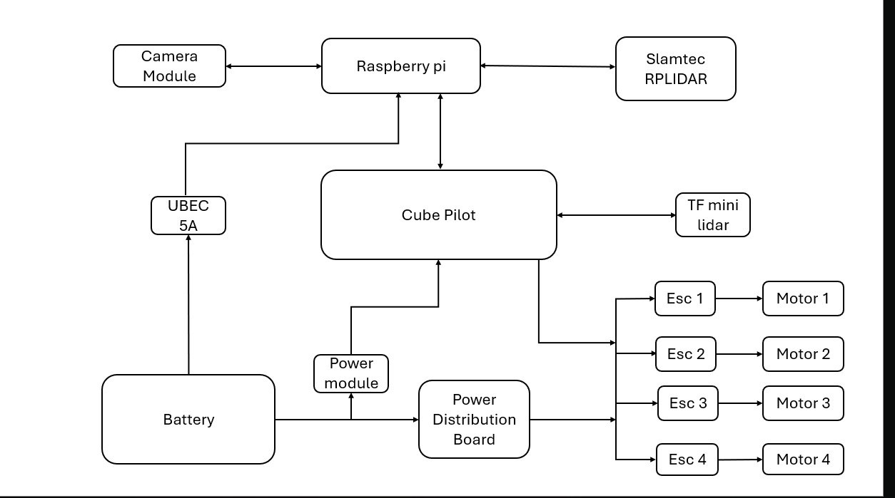
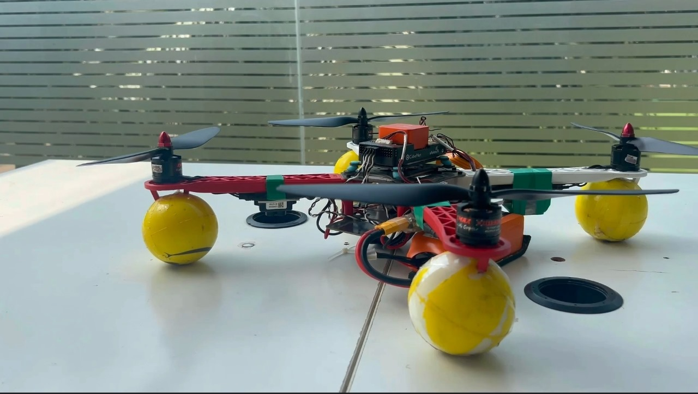
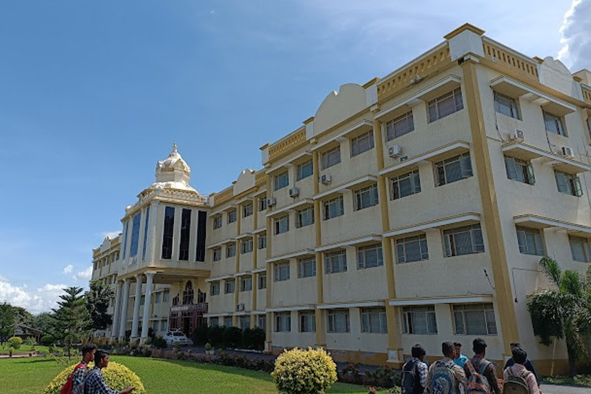

# 🚀 ANAV - Autonomous Navigation Aerial Vehicle (ISRO Challenge 2025 - Qualification Round)

**Team: AetherX**  
**Event: ISRO’s IRoC-U 2025 Challenge**  
**Stage: Qualified the National Level with GPS-Denied Autonomous Drone**

---

## 📖 Project Overview

The **ANAV (Autonomous Navigation Aerial Vehicle)** is a quadrotor drone designed to autonomously take off, hover, and land **without GPS**, tailored for extraterrestrial terrains like **Mars**. This system qualified the **ISRO Challenge 2025 - Qualification Round**, showcasing its capability to operate with precision and safety under constrained environments.

It uses a powerful stack of embedded systems, LiDAR sensors, optical flow, and computer vision—all controlled by **Raspberry Pi 5** and **CubePilot Orange**.

---

## 🧭 System Architecture

> ANAV integrates CubePilot Orange for low-level flight control and Raspberry Pi 5 for high-level mission logic and perception. Position control is maintained using HereFlow Optical Flow and TFMini LiDAR in a GPS-denied environment.

---

## 🔧 Core Hardware Components

| Component                  | Description                                               |
|----------------------------|-----------------------------------------------------------|
| DJI F450 Frame             | Lightweight quadcopter airframe                           |
| Raspberry Pi 5 (8GB)       | Companion computer for decision-making and sensor fusion  |
| CubePilot Orange           | Flight controller with real-time motor and sensor control |
| TFMini-S LiDAR             | Provides precise altitude measurements                    |
| HereFlow Optical Flow      | Horizontal motion tracking in GPS-denied conditions       |
| RPLiDAR A1M8 (360°)        | Environmental mapping for terrain sensing                 |
| 5200mAh 4S LiPo Battery    | Optimized for ~10–12 minutes of flight                    |
| 935KV Brushless Motors     | Provides lift with carbon fiber propellers                |
| ESCs (40A)                 | Motor speed control                                       |

---

## 🧠 Software Architecture

| Component        | Role                                                              |
|------------------|-------------------------------------------------------------------|
| **ROS Noetic**   | Middleware to manage nodes and control logic                      |
| **MAVROS**       | Bridge between ROS and CubePilot via MAVLink                      |
| **Python/C++**   | Scripted mission logic and sensor drivers                         |
| **State Machine**| Controls takeoff → hover → land → emergency handling              |
| **Failsafe Nodes**| Handle battery monitoring, link loss, and geofence violations     |

---

## 🚀 Mission Logic (Autonomous Mode)

1. 🟢 **Start & Init** – System boots, calibrates sensors, and links RPi5 ↔ CubePilot
2. 🛫 **Takeoff** – Ascend to 3–10 meters using LiDAR + IMU + Optical Flow
3. ✈️ **Hover** – Maintain altitude and position for 30 seconds
4. 🛬 **Landing** – Controlled descent to initial position (within 1.2×1.2 m)
5. 🛡️ **Failsafe** – Auto-landing on battery drop, signal loss, or instability

---

## 🔍 Emergency Response System (ERS)

ANAV incorporates both **hardware-level** and **software-level** safety mechanisms:

- Manual Kill Switch (via GCS or RC)
- Battery Voltage Monitoring (`battery_monitor.py`)
- Link-Loss Handling (heartbeat timeout triggers auto-land)
- Geofence violation detection and correction
- Logging using `rosbag` for post-mission diagnostics

---

## 🧪 Tests Conducted

| Test | Description | Outcome |
|------|-------------|---------|
| 🛠️ Thrust Calibration | Motor sync and ESC tuning | ✅ Resolved yaw instability |
| 🛰️ Altitude Hold | Hovering at 3m using LiDAR + Optical Flow | ✅ Stable hover achieved |
| ✈️ Autonomous Flight | Single-command auto takeoff → hover → land | ✅ Successful 30s hover + smooth landing |
| 💥 Emergency Protocol | Link loss, battery drop, manual abort | ✅ Auto-landing triggered safely |

---

## 🎯 Key Innovations

- ✅ **GPS-Free Navigation** using optical flow + LiDAR fusion
- ✅ **Single Command Mission** (auto-start initiates full flight cycle)
- ✅ **Modular ROS Nodes** for easy debugging and reuse
- ✅ **Precision Hovering** even in low-texture, dusty indoor conditions
- ✅ **Mentored by ISRO Officials & Academicians**

---
## 🧑‍💻 Team & Roles

| Role                      | Responsibilities                                         |
|---------------------------|-----------------------------------------------------------|
| Project Manager           | System design, testing coordination, reporting            |
| Embedded Systems Lead     | Flight controller interfacing, ESC tuning, PID configs    |
| AI/Navigation Engineer    | Sensor fusion, Loiter logic, optical flow tracking        |
| Power Systems Engineer    | Battery integration, emergency voltage fail-safes         |
| Software Developer        | ROS node architecture, state machines, Python scripting   |
| Testing & Validation Lead | Hover tests, emergency handling, calibration debugging    |

---
## 📸 Drone Hover Test (Qualification)

> The ANAV drone successfully completed the 30-second hover test indoors without GPS, marking a milestone toward ISRO qualification.
> Demo Link:
## 🪐 ISRO Challenge 2025 – Milestones

- [📍 Step 1 – LinkedIn Post by Manoj Kumar (Initial Demo)](https://www.linkedin.com/posts/manoj-kumar-a-21ab69258_isrochallenge2025-anav-autonomousdrone-activity-7318255793064013825--IQ0)
- [🏁 Step 2 – Final Recognition by MSMF on LinkedIn](https://www.linkedin.com/posts/msrc-msmf-0bb8742bb_isrochallenge2025-spacetechnology-engineeringinspiration-ugcPost-7322105078079791104-m5ez)

---
## 🏆 Recognition

✅ Successfully qualified the **ISRO IRoC-U 2025 Challenge – Qualification Round**  
📄 [Full Design Report (PDF)](https://github.com/ManojCodeCraft/Qualification-Round-ISRO-Challenge-2025/blob/main/QUALIFICATION%20ROUND/docs/ANAV%20DESIGN%20REPORT.pdf)

---
## 🎓 Built At – GPCET (G. Pullaiah College of Engineering and Technology)

> The ANAV drone system was designed, built, and tested at GPCET, Kurnool, under expert mentorship and ISRO collaboration.
----
## 📄 License

This project is licensed under the [MIT License](LICENSE)

---

## 👋 Connect With Me

**Manoj Kumar**  
- 🔗 [LinkedIn](https://www.linkedin.com/in/manoj-kumar-a-21ab69258/)  
- 💻 [GitHub](https://github.com/ManojCodeCraft)
"""
